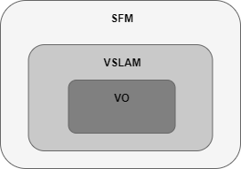
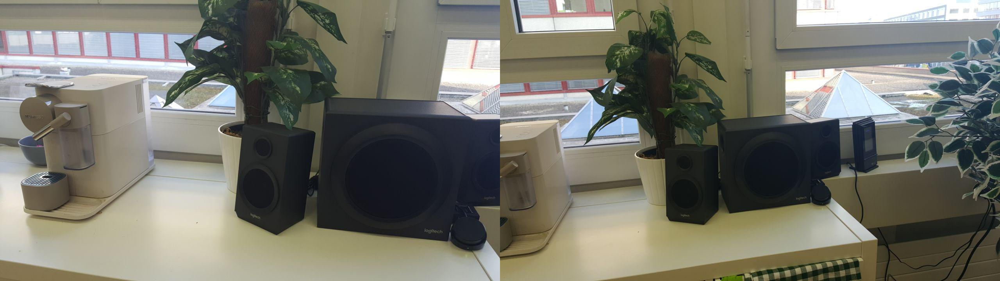
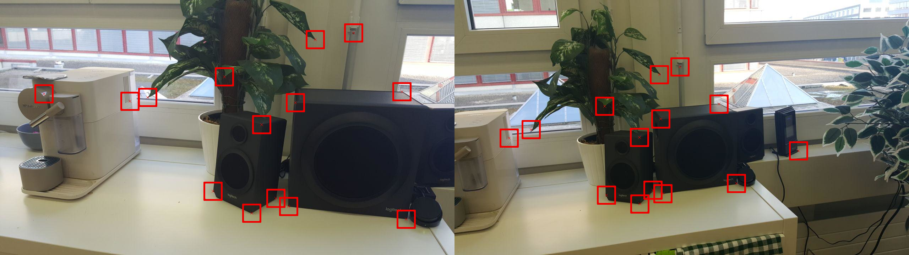
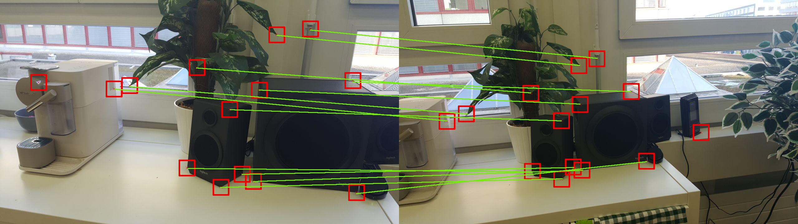
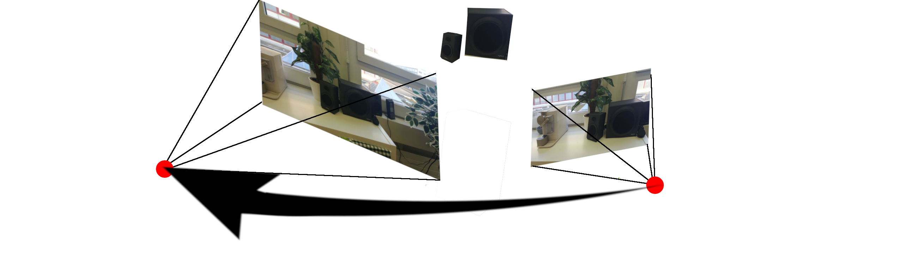

# Chapter 1 - Overview

This is the first of a whole series of articles about Visual Odometry and Visual Algorithms. The goal of these series
is to give deeper insights into how visual algorithms can be used to estimate the cameras position and movement from 
its images only. Such algorithms can then be used in robots, cars and drones to enable autonomous movement.

So what is Visual Odometry all about? In simple words Visual Odometry estimates the position and orientation of the 
camera in a iterative manner just by analyzing the images. From the change on the estimated poses the motion can be 
derived. In contrast to most other approaches which are based on some sensors data or other mechanical data the 
visual approach is not affected as much by uncertainties. For Wheel odometry it is a huge problem when the wheels 
are slipping or for gps obstruction landscape of buildings are a problem. Inertial measurement units (IMU) are prone 
to shift when small discrepancies are introduce they hardly are able to recover.

However also Visual Odometry can not always be applied and some assumptions have to be met enabling reasonable results.
First of all since VO is based on image input, a sufficient illumination is needed so that representative images can be 
produced. Next up for deriving the motion of a vehicle a large portion of the image should originate from a static 
scenery. The motion is constructed by looking at the difference of subsequent images, therefore the images should 
contain enough texture so that the object on the images can be match to each other. Obviously there have to be a 
certain overlap in consecutive frames so the the relation between then is not lost.

## History of Visual Odometry

The field of VO originates from research of the NASA. The first known application of VO was made by Hans Moraveck 
in 1980 who used a sliding stereo camera in his PhD thesis which was part of the development of the mars rovers. 
Up to 2000 most VO research originated from NASA in preparation of the Mars missions. In 2004 David Nister wrote a 
paper called "Visual Odometry" which popularize the term.

## Some terminology

There are different versions of visual algorithms which tackles different aspects of the overall problems. It is 
important to understand the difference of these algorithms and what the goal of them is. Here some of the are explained 
and are put into relation. 

### Structure from Motion (SFM)

The first term that we want to explain is "Structure from Motion" (SFM). SFM is more general 
than Visual Odometry because it only tackles the problem of estimating the pose and not the motion. So the Goal of the 
SMF is to estimate 6 different degrees of freedom, three for the position and three for the orientation. Also in 
contrast to VO which works with a sequence of images, SFM is applied to a set of unordered images. An example for SFM 
can be read about int he paper "Building Rome in a Day" in which the the authors construct a 2D model of romes city 
center by butting together the pose estimation of millions of photos taken by tourists. Due to the fact that the images 
for SFM are unordered is becomes clear that for SFM real time applications are barely possible. SFM is more a post 
processing task.

### Visual SLAM (VSLAM)

Another extension the the basic VO is the Visual SLAM (VSLAM) where SLAM stands for "**S**imultaneous **L**ocalization 
**A**nd **M**apping". Since VO only guarantees local consistency it can happen that all the small error add up which 
then becomes well visible in closed loop motion when start and endpoint should line up but won't with basic VO. SLAM
adjusts the model in a way so that it consistently checks if it recognized the surrounding so that if it does it can
try to close the loop and therefore adjust the previous estimation. In simple words SLAM enables global consistency 
using loop detection and loop closure.

So we can say VO is part of VSLAM which itself is part of SFM.

All Visual Odometry algorithms follow the same process model. An image sequence or a unordered image set is used as input.
Then the algorithm detects features, which are certain points in the image which it can recognize. These points are than
tracked throught the sequence/ set of images. From the translation on the images of these features the 3D relation 
between then can be estimated as well as the motion of the camera. In the end the estimations are optimized using local 
optimisation methods. The the basic workflow of Vo is:

1. Reading Image Sequence
2. Feature detection
3. Feature matching and tracking
4. Motion estimation
5. Local optimisation

